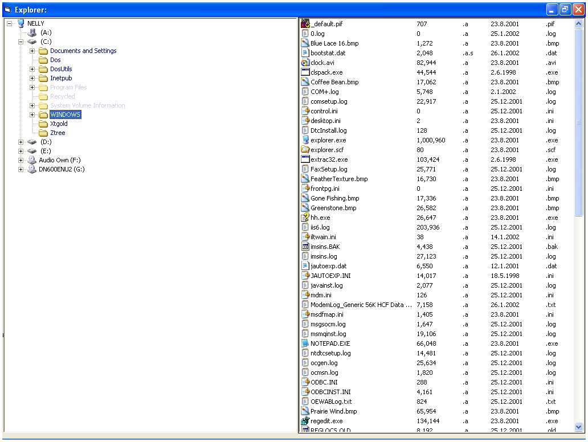



## Explorer v1\.3

### Description

This is the third update to my ExplorerTree, whats new, 1. Icons are displayed

in each FileList, this does it a different way than usual. If you have 2000 + files

in a Folder, listing all the Files, icons and information associated with those

Files takes ages, the File information isn`t the problem, it`s the icon information

that takes ages even using API. this version of ExplorerTree only displays the icons as they are

displayed in the FileList. Once all the icons have been displayed the gathering of

icon information stops (loop stops). Much better than waiting for all the File icon

information to display in the FileList.
 
### More Info
 

             |
---                |---
**Submitted On**   |2002-01-26 15:27:36
**By**             |[Nelly](https://github.com/Planet-Source-Code/PSCIndex/blob/master/ByAuthor/nelly.md)
**Level**          |Advanced
**User Rating**    |5.0 (40 globes from 8 users)
**Compatibility**  |VB 6\.0
**Category**       |[Complete Applications](https://github.com/Planet-Source-Code/PSCIndex/blob/master/ByCategory/complete-applications__1-27.md)
**World**          |[Visual Basic](https://github.com/Planet-Source-Code/PSCIndex/blob/master/ByWorld/visual-basic.md)
**Archive File**   |[Explorer\_v53475262002\.zip](https://github.com/Planet-Source-Code/nelly-explorer-v1-3__1-31549/archive/master.zip)

### API Declarations

Lots.

